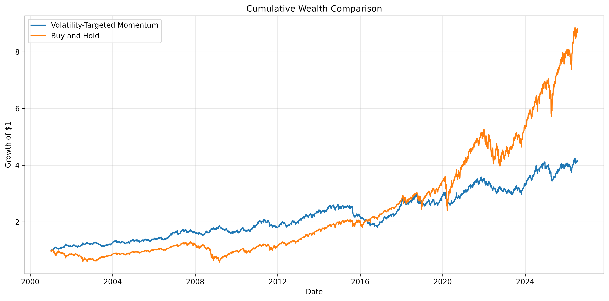
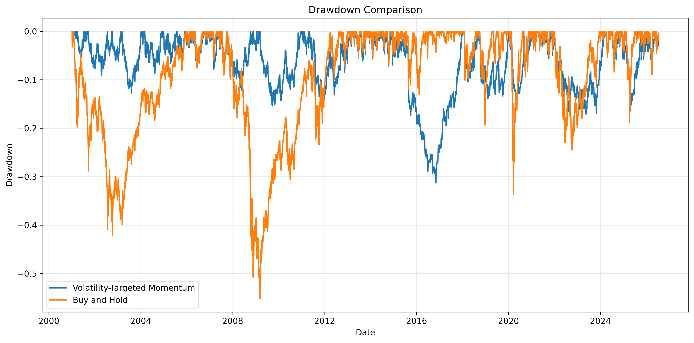

<div align="center">

# 📈 Volatility-Targeted Time-Series Momentum

### A Multi-Asset Quantitative Finance Research Project

Dynamic Risk Management • Multi-Asset Portfolio Construction • Volatility Targeting • Reproducible Research

<br>


<br>


</div>

---

# Project Overview

This project investigates the implementation of a **Volatility-Targeted Time-Series Momentum (VTM)** strategy across multiple asset classes. The objective is to evaluate whether combining momentum signals with dynamic volatility scaling can improve the risk-adjusted performance of a diversified investment portfolio.

The framework progresses from a single-asset implementation to a diversified multi-asset portfolio before introducing **portfolio-level volatility targeting**. The entire project is implemented in Python using a modular architecture and includes automated unit tests and a fully reproducible Jupyter notebook.

---

# Table of Contents

- Project Overview
- Research Question
- Methodology
- Strategy Components
- Asset Universe
- Repository Structure
- Results
- Figures
- Main Features
- Technologies
- Installation
- References
- License

---

# Research Question

> Can portfolio-level volatility targeting improve the risk-adjusted performance of a diversified time-series momentum strategy compared with a conventional momentum portfolio?

---

# Methodology

```text
Historical Market Data
        │
        ▼
Daily Return Calculation
        │
        ▼
Momentum Signal Generation
        │
        ▼
Rolling Volatility Estimation
        │
        ▼
Position Scaling
        │
        ▼
Multi-Asset Portfolio Construction
        │
        ▼
Portfolio-Level Volatility Targeting
        │
        ▼
Performance Evaluation
```

---

# Strategy Components

- Historical market data collection
- Daily return calculation
- Time-series momentum signal generation
- Rolling volatility estimation
- Volatility scaling
- Transaction cost modelling
- Single-asset backtesting
- Multi-asset portfolio construction
- Portfolio-level volatility targeting
- Performance evaluation
- Sensitivity analysis

---

# Asset Universe

| ETF | Asset Class |
|------|-------------|
| SPY | U.S. Equities |
| QQQ | Technology Equities |
| GLD | Gold |
| TLT | U.S. Treasury Bonds |
| DBC | Commodities |
| VNQ | Real Estate |

---

# Repository Structure

```text
Volatility-Targeted-Time-Series-Momentum/

├── data/
├── notebooks/
├── results/
├── src/
├── tests/
├── README.md
├── requirements.txt
└── .gitignore
```

---

# Results

The framework evaluates four investment strategies:

- Buy-and-Hold
- Single-Asset Momentum
- Diversified Multi-Asset Portfolio
- Portfolio-Level Volatility Targeting

Portfolio-level volatility targeting successfully restored the portfolio to the desired annualized volatility target while improving the overall risk-adjusted performance.

## Performance Summary

| Strategy | CAGR | Annualized Volatility | Sharpe Ratio |
|-----------|------:|----------------------:|-------------:|
| Buy & Hold (SPY) | **8.86%** | **19.07%** | **0.541** |
| Volatility-Targeted Momentum (SPY) | **5.72%** | **11.13%** | **0.555** |
| Multi-Asset Portfolio | **2.52%** | **5.89%** | **0.452** |
| 10% Targeted Portfolio | **4.76%** | **10.16%** | **0.509** |

---

# Figures

## Wealth Curve

<p align="center">

</p>

---

## Drawdown Comparison

<p align="center">

</p>

---


# Main Features

- Modular Python implementation
- Multi-asset portfolio construction
- Portfolio-level volatility targeting
- Transaction cost modelling
- Automated unit tests
- Reproducible Jupyter notebook
- Performance evaluation using standard financial metrics

---

# Technologies

- Python
- Pandas
- NumPy
- Matplotlib
- PyTest
- Jupyter Notebook

---

# Installation

Clone the repository

```bash
git clone https://github.com/benrejebmeryem9-99/Volatility-Targeted-Time-Series-Momentum.git
```

Install dependencies

```bash
pip install -r requirements.txt
```

Launch Jupyter Notebook

```bash
jupyter notebook
```

Open

```text
notebooks/02_Main_Backtest.ipynb
```

and run all cells to reproduce the analysis.

---

# References

- Moskowitz, T., Ooi, Y., & Pedersen, L. (2012). *Time Series Momentum*. Journal of Financial Economics.
- Moreira, A., & Muir, T. (2017). *Volatility-Managed Portfolios*. Journal of Finance.
- Barroso, P., & Santa-Clara, P. (2015). *Momentum Has Its Moments*. Journal of Financial Economics.
- Hurst, B., Ooi, Y., & Pedersen, L. (2017). *A Century of Evidence on Trend-Following Investing*.

---

# License

This project is released under the MIT License.

---

<div align="center">


</div>